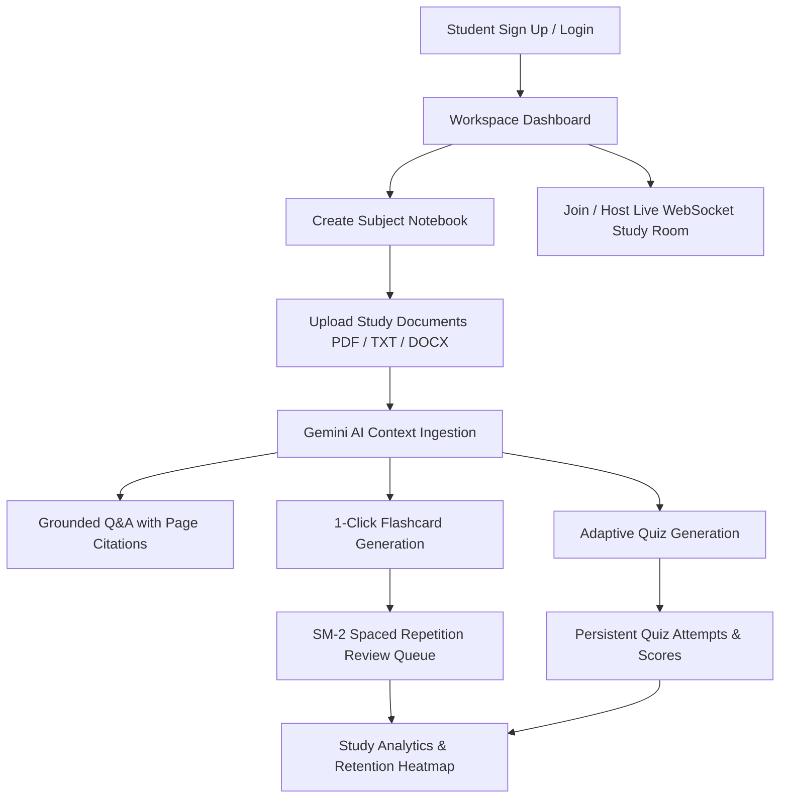
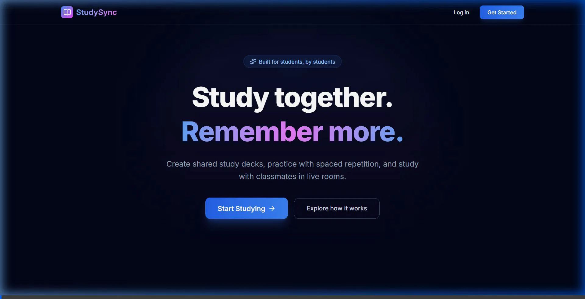
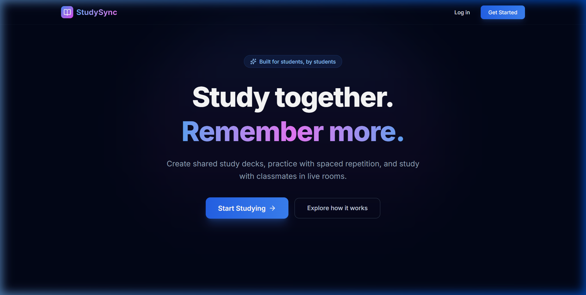
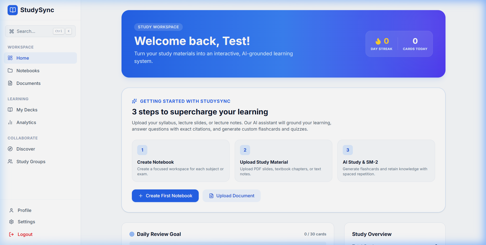
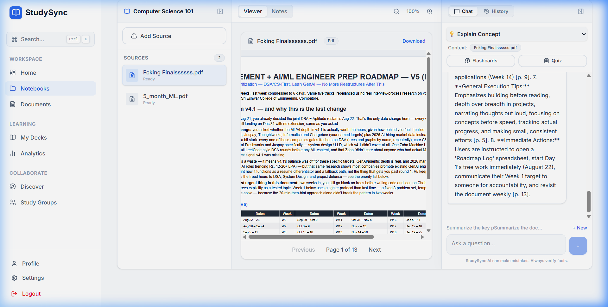
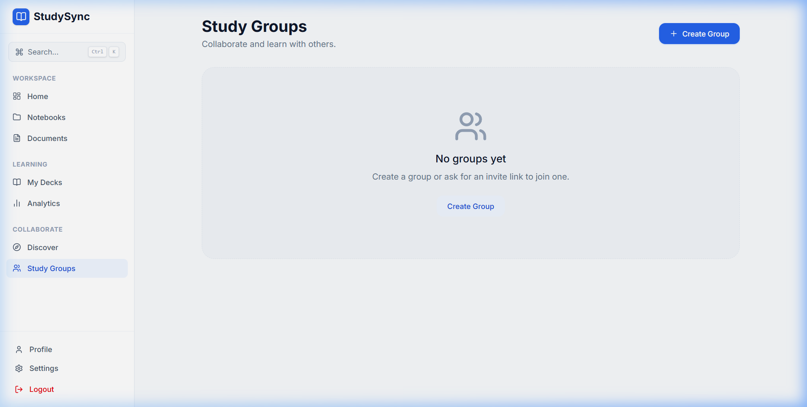
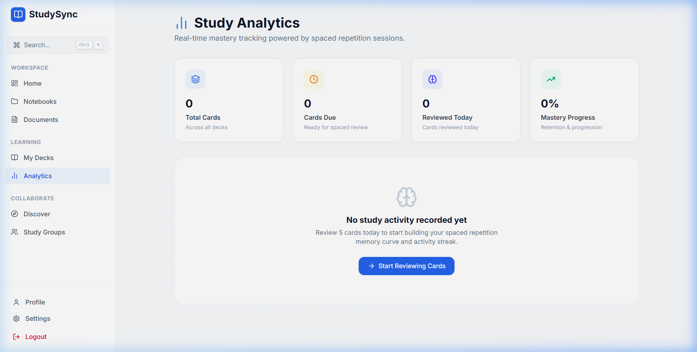

<div align="center">

# 🎓 StudySync
### *Turn your study material into an interactive, source-grounded AI learning workspace.*

[](https://reactjs.org/)
[](https://www.typescriptlang.org/)
[](https://fastapi.tiangolo.com/)
[](https://www.python.org/)
[](https://www.mongodb.com/atlas)
[](https://ai.google.dev/)
[](https://websockets.readthedocs.io/)
[](https://tailwindcss.com/)
[](LICENSE)

[Features](#-key-features) • [User Journey](#-user-journey) • [Architecture](#-system-architecture) • [Demo Walkthrough](#-demo-walkthrough) • [Getting Started](#-getting-started) • [Deployment](#-deployment-guide)

</div>

---

## 🌟 Overview

**StudySync** is a production-grade, AI-powered personal study workspace designed to solve the fragmented study experience students face today. Instead of juggling detached PDFs, notes, flashcard apps, and ChatGPT tabs, StudySync unifies your entire learning workflow into one cohesive, source-grounded hub:

1. **Attach Your Sources**: Upload lecture PDFs, syllabi, notes, and research materials into focused **Notebook Workspaces**.
2. **Grounded AI Tutor**: Chat with Google Gemini with multi-document context grounding and **verifiable page citations** (`[p. 1]`, `[p. 5]`).
3. **Automated Flashcard & Quiz Generation**: Instantly extract key concepts into structured flashcards or customized MCQ assessments.
4. **SuperMemo SM-2 Spaced Repetition**: Maximize retention with mathematically scheduled reviews that adapt to your recall performance.
5. **Real-Time Collaboration**: Create study groups and join live WebSocket study rooms with synchronized timers, member presence, and chat.

---

## 🚀 Key Features

| Feature | Description |
|---|---|
| 📑 **Multi-Source Notebooks** | 3-panel study cockpit featuring left source manager, center document viewer/notes, and right AI tutor panel. |
| 🤖 **Grounded AI RAG Engine** | Powered by `gemini-2.5-flash` with document grounding, on-the-fly uploads, and interactive inline citations. |
| 🧠 **SM-2 Spaced Repetition** | Adaptive algorithm calculating custom Ease Factors, repetition streaks, and exact review intervals. |
| 📝 **Persistent Quiz System** | Real MCQ and true/false assessments with instant grading, explanations, and attempt history tracking. |
| 👥 **Study Groups & Invite Links** | Role-based collaboration with shared decks, member directories, and one-click cryptographic invite links. |
| ⚡ **Live WebSocket Study Rooms** | Real-time synchronized study sessions with live member presence and group chat. |
| 📊 **Genuine Study Analytics** | GitHub-style 30-day activity heatmap, 7-day review volume charts, and mastery progression metrics. |
| 🛡️ **Zero-IDOR Security** | Complete ownership validation and cascade deletions ensuring data integrity and user isolation. |

---

## 🗺️ User Journey



---

## 🎥 Demo Walkthrough

### 🎬 Full End-to-End User Experience
A complete live walkthrough demonstrating registration, dashboard analytics, notebook creation, grounded PDF study, and collaborative groups:

<div align="center">
  
</div>

<br />

### 1. Landing Page & Design System
Modern, responsive interface featuring curated typography, dark mode surfaces, and clear study paths:

<div align="center">
  
</div>

<br />

### 2. Actionable Learning Dashboard
Actionable metrics tracking study streaks, active flashcard reviews due, quick notebook access, and onboarding guides:

<div align="center">
  
</div>

<br />

### 3. Source-Grounded AI Tutor & Citations
Ask conceptual questions about your study documents. StudySync's AI assistant grounds every answer directly in your sources with clickable page citations:

<div align="center">
  
</div>

```
User: "What are the key points in this ML roadmap?"
AI: "According to [Fcking Finalssssss.pdf, p. 1], the roadmap establishes a 5-stage progression:
     1. Python & Core Mathematics [p. 2]
     2. Supervised & Unsupervised Learning Algorithms [p. 3-5]
     3. Deep Learning & Neural Architectures [p. 6-8]
     4. MLOps, CI/CD, and Production Deployment [p. 9-10]
     5. Capstone Engineering Projects & Portfolio [p. 13]"
```

<br />

### 4. Collaborative Study Groups & Live Rooms
Collaborate with peers, share flashcard decks, and join live WebSocket rooms with real-time presence:

<div align="center">
  
</div>

<br />

### 5. Genuine Analytics & Activity Heatmap
Track retention rate, learned cards, daily study volume, and a 30-day GitHub-style study heatmap:

<div align="center">
  
</div>

<br />

### 6. SuperMemo SM-2 Interval Calculation
Flashcard reviews adapt dynamically using the classic SuperMemo-2 algorithm:

$$\text{EF}' = \text{EF} + \left(0.1 - (5 - q) \times (0.08 + (5 - q) \times 0.02)\right)$$

* Where $q \in [0, 5]$ is the student's rating of recall quality.
* Minimum Ease Factor is clamped at $1.3$.
* Scheduling intervals: $I_1 = 1\text{ day}$, $I_2 = 6\text{ days}$, $I_n = I_{n-1} \times \text{EF}'$.

---

## 🏗️ System Architecture

```
StudySync/
├── frontend/                     # React 18 + Vite SPA
│   ├── src/
│   │   ├── api/                 # Axios client with interceptors & JWT refresh
│   │   ├── components/          # Reusable UI components & Modals
│   │   │   └── ui/              # Button, Input, Modal, Spinner, CommandPalette
│   │   ├── hooks/               # useAuth, useWebSocket, useDebounce
│   │   ├── pages/               # Dashboard, Notebooks, Groups, Rooms, Analytics
│   │   └── types/               # Strict TypeScript interface definitions
│   ├── vite.config.ts           # Development proxy & Tailwind CSS v4 pipeline
│   └── package.json
│
├── backend/                      # FastAPI Python Application
│   ├── app/
│   │   ├── algorithms/          # Pure SM-2 spaced repetition logic
│   │   ├── api/                 # REST Routers (auth, notebooks, ai, quizzes, groups)
│   │   ├── core/                # JWT security, config settings, dependencies
│   │   ├── db/                  # MongoDB connection, compound indexes, migration
│   │   ├── schemas/             # Pydantic v2 schemas for request/response validation
│   │   ├── services/            # ai_service (Gemini), document_service, deck_service
│   │   └── main.py              # Application lifespan, CORS, error handlers
│   ├── requirements.txt         # Production Python dependencies
│   └── .env.example             # Safe template for environment configuration
│
├── .gitignore                   # Comprehensive rule set protecting credentials & uploads
└── README.md
```

---

## 🔌 API Endpoints Summary

### Authentication & Users
- `POST /api/v1/auth/register` — Register a new student account
- `POST /api/v1/auth/login` — OAuth2 password flow with JWT return
- `GET /api/v1/auth/me` — Retrieve current authenticated profile

### Notebooks & Documents
- `GET /api/v1/notebooks` — List user notebooks
- `POST /api/v1/notebooks` — Create a new study workspace
- `POST /api/v1/documents` — Multipart file upload (PDF, DOCX, TXT, PPTX)
- `GET /api/v1/documents/{id}/content` — Stream document with token authentication

### AI Learning & Grounding
- `POST /api/v1/ai/generate` — Grounded Q&A with document citations
- `POST /api/v1/ai/flashcards` — Generate structured flashcards from sources
- `POST /api/v1/quizzes/generate` — Generate customizable MCQ quizzes
- `POST /api/v1/quizzes/{id}/attempt` — Persist real quiz attempt and grade answers

### Spaced Repetition & Study Groups
- `POST /api/v1/decks/{id}/cards` — Add cards to deck
- `POST /api/v1/study/{card_id}/review` — Submit SM-2 quality rating (0-5)
- `GET /api/v1/groups/{id}` — Retrieve group members, decks, and active rooms
- `WS /ws/rooms/{room_id}` — Live WebSocket room presence and chat

---

## 🛠️ Getting Started

### Prerequisites
- **Node.js**: v18 or higher
- **Python**: v3.11 or higher
- **MongoDB Atlas** database account
- **Google Gemini API Key** from [Google AI Studio](https://aistudio.google.com/)

### 1. Clone the Repository
```bash
git clone https://github.com/hareshr066/StudySync_v01.git
cd StudySync_v01
```

### 2. Backend Setup
```bash
cd backend

# Create virtual environment
python -m venv venv
# On Windows:
venv\Scripts\activate
# On macOS/Linux:
source venv/bin/activate

# Install dependencies
pip install -r requirements.txt

# Configure environment variables
cp .env.example .env
```

Edit `backend/.env` with your credentials:
```env
MONGODB_URI=mongodb+srv://<username>:<password>@<cluster>.mongodb.net/?appName=Cluster0
MONGODB_DATABASE=studysync
JWT_SECRET=your-random-secret-key-32-chars
JWT_REFRESH_SECRET=your-random-refresh-key-32-chars
GEMINI_API_KEY=your-gemini-api-key-here
GEMINI_MODEL=gemini-2.5-flash
FRONTEND_URL=http://localhost:5173
```

Start the backend:
```bash
python -m uvicorn app.main:app --reload --port 8000
```
- API Health Check: `http://localhost:8000/health`
- Swagger Interactive Docs: `http://localhost:8000/docs`

### 3. Frontend Setup
```bash
cd ../frontend

# Install dependencies
npm install

# Start Vite development server
npm run dev
```
Open `http://localhost:5173` in your browser.

---

## 🚢 Deployment Guide

### Deploying the Backend (Render / Railway / Fly.io)
1. Set the build command: `pip install -r requirements.txt`
2. Set the start command: `uvicorn app.main:app --host 0.0.0.0 --port $PORT`
3. Configure environment variables matching `backend/.env.example` (`MONGODB_URI`, `JWT_SECRET`, `GEMINI_API_KEY`, `FRONTEND_URL`).

### Deploying the Frontend (Vercel / Netlify / Cloudflare Pages)
1. Connect your GitHub repository to Vercel/Netlify with Root Directory: `frontend`.
2. Build command: `npm run build`
3. Output directory: `dist`
4. Set environment variable: `VITE_API_URL=https://your-backend-api.onrender.com`

---

## 🔒 Security Best Practices
- **Never commit `.env` files**: All secrets are ignored via `.gitignore`.
- **RBAC & IDOR Verification**: Every query enforces strict ownership verification across MongoDB `ObjectId` references.
- **Cascading Integrity**: Deleting a deck, notebook, or document automatically cascades cleanup to all associated cards, notes, quiz attempts, and sessions.

---

## 📄 License
This project is open-source under the [MIT License](LICENSE).

<div align="center">
Built with ❤️ by <strong>Haresh R</strong> • Connect on <a href="https://www.linkedin.com/in/haresh-r-432851253/">LinkedIn</a>
</div>
